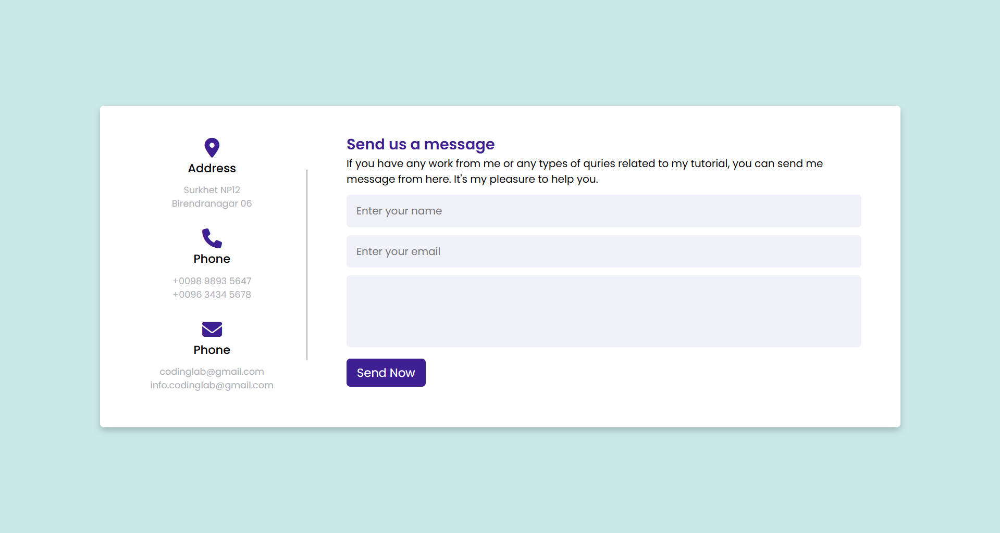

# 🌐 Responsive Contact Us Page

## 📋 Overview
This is a **responsive Contact Us page** built using **only HTML and CSS**.  
It includes a clean, modern design suitable for websites like **E-Shop**, **Portfolio**, and **Company Landing Pages**, where a contact section is often essential but sometimes missing.

---

## ✨ Features
- 📱 Fully responsive layout for all devices  
- 💬 User-friendly form design  
- 🎨 Simple and elegant UI with hover effects  
- 🧱 Built using pure HTML and CSS (no JavaScript)

---

## 🧩 Sections Included
- **Address** – Displays location details  
- **Phone** – Contact numbers for easy access  
- **Email** – Professional email contact  
- **Message Form** – Allows users to send messages or queries  

---

## 🖼️ Preview

---

## 💡 How to Use
1. Clone or download the project files.  
2. Open `index.html` in any web browser.  
3. Explore and customize it as per your project.

---

## 🏷️ Category
**Websites and UI**

---

## 🛠️ Tech Stack
- HTML5  
- CSS3  
- Font Awesome Icons  

---

## 🎯 Contribution
This page can be added to the **“Websites and UI”** category of the repository to enhance UI examples and improve completeness for projects like **Portfolio** or **E-Shop** websites.

---
