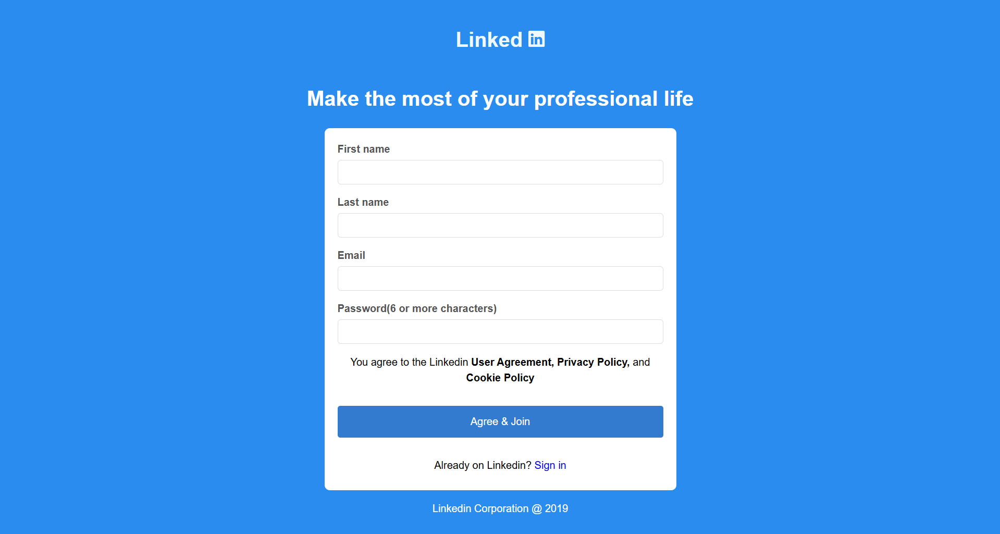

# Simple Website using HTML & CSS

### 📝 Description
This pull request adds a **simple responsive website** built using only **HTML and CSS**.  
It showcases how to design and structure a webpage without using JavaScript.

### ✨ Features
- Responsive and clean design  
- Built purely with HTML and CSS  
- Properly linked in the main `index.html` file  

### 🔗 Issue Reference
Fixes #359  

### 📂 Files Updated
- Added a new website folder inside the project  
- Updated main `index.html` to include a link to the new webpage  

### 📸 Preview
(Attach a screenshot of your website here)
